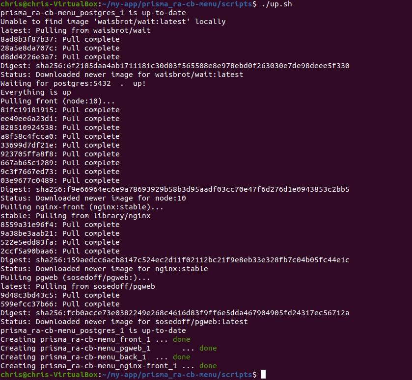

# express-hasura_ra-cb-menu
# This project uses postgres as a database for a React-admin data provider.
## Please note this is currently in development and not yet full operational. 
### This project uses hasura for the front-end database queries and express JS for backend business logic.
### It's all built in docker and uses bash scripts to create and init the database
### An nginx reverse proxy configuration is included
### The project is to build a dashboard for a real-life burger resturant that will allow the staff to edit the menu. 

Please note: Although I am a seasoned tech guy I am quite a novice as a developer.
Having said that you are welcome to lodge support Issues here and I will help you as much as I can. I am currently unemployed so have oodles of free-time to
learn to code and to help others learn.


This project uses [ra-data-hasura-graphql](https://github.com/Steams/ra-data-hasura-graphql) as a dataprovider.


The back-end uses [Express](https://github.com/auth0/express), [Express-jwt](https://github.com/auth0/express-jwt) and [express-jwt-authz](https://github.com/auth0/express-jwt-authz).


### Procedure

The first step is to 'git clone' the repo.

In this case:

```
git clone https://github.com/affluent-bilby-classifieds/express-hasura_ra-cb-menu.git
```

change to the directory:

```
cd express-hasura_ra-cb-menu
```


You may need to add execute permission to the build scripts.

```
cd scripts
```


```
chmod +x *.sh
```

install jq

```
sudo apt-get install jq -y

```


In the next part we load the docker-compose.yml file to build our containers and to do this we run the up script and get this party started:

```
./up.sh
```
You should see it go something like this:




Install dependencies for front and back:

```
cd ..
```
```
docker-compose run front /bin/sh
```
```
cd /home/app
```

```
npm install
```
```
exit
```

```
docker-compose run back /bin/sh
```

```
cd /home/app
```
```
npm install
```
```
exit
```


Start-docker containers again:

```
docker-compose up -d
```
Create a new user:

```
curl -X POST http://localhost:3000/api/create_user -H 'Cache-Control: no-cache' -H 'Content-Type: application/json' -d '{ "email": "test@test.com", "password": "Password1" }'
```

You should get:
{"result":"user created."}

This uses express.js (in the server.js file) to add a line to the users table. The password is hashed with bcrypt.
The users table as well as the other provided tables are built on demand using the seed.sql file. After this the fixtures.sql fills
the tables with example data.


All containers should now be up, and you can go to http://localhost:3000 in your browser.


### Verifications

- you should be able to log in with the user you created.

- you should be able to create, edit, and delete items.


### Notes

We have just signed up for the [Supabase.io](https://github.com/supabase/supabase) public alpha!

- we use a nginx load-balancer in front of the dev server, so that we can easily route
API calls to the back docker container, without messing with front dev server parameters.

- do NOT use this setup in production! This is a dev environment! For production you would have
to make Dockerfiles for front and back (front Dockerfile would use among other things "npm run build" command), build those docker containers and use them in docker-compose.yml, instead of mapping source code inside containers with docker filesystem mappings + installing manually dependencies.
