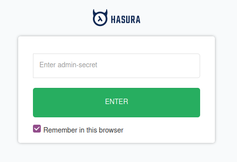

# express-hasura_ra-cb-menu
# This project uses Postgres as a database for a React-Admin data provider.
## Please note this is currently in development and not yet fully operational. 
### This project uses Hasura for the front-end database queries and Express-JS for backend business logic.
### It's all built in Docker and uses bash scripts to create and init the database
### An nginx reverse proxy configuration is included
### The project is to build a dashboard for a real-life burger resturant that will allow the staff to edit the menu. 

Please note: Although I am a seasoned tech guy I am quite a novice as a developer.
Having said that you are welcome to lodge support Issues here and I will help you as much as I can. I am currently unemployed so have oodles of free-time to
learn to code and to help others learn.

We use Ubuntu 20.04 as a dev environment. We also run virtual-box with Ubuntu 20.04 as a guest for a testing environment. How you setup your environment is a matter of personal preference. 
This project uses [ra-data-hasura-graphql](https://github.com/Steams/ra-data-hasura-graphql) as a data provider.
- [React-Admin](https://github.com/marmelab/react-admin)

The back-end uses [express](https://github.com/auth0/express), [express-jwt](https://github.com/auth0/express-jwt) and [express-jwt-authz](https://github.com/auth0/express-jwt-authz).


## Prerequisites

- [Docker Engine](https://docs.docker.com/engine/) (version `19.03.11`)
- [Docker Compose](https://docs.docker.com/compose/) (version `1.25.0`)
- [nodejs](https://nodejs.org/en/) (version `v14.50.0`)

Install nodejs 14.5.0 from [nodesource](https://github.com/nodesource/distributions/blob/master/README.md)


### Procedure

The first step is to 'git clone' the repo.

In this case:

```
git clone https://github.com/affluent-bilby-classifieds/express-hasura_ra-cb-menu.git
```

change to the directory:

```
cd express-hasura_ra-cb-menu
```


You may need to add execute permission to the build scripts.

```
cd scripts
```


```
chmod +x *.sh
```

install jq

```
sudo apt-get install jq -y

```


In the next part we load the docker-compose.yml file to build our containers and to do this we run the up script and get this party started:

```
./up.sh
```
You should see it go something like this:

```
./up.sh 
Creating network "express-hasura_ra-cb-menu_default" with the default driver
Creating volume "express-hasura_ra-cb-menu_data" with default driver
Pulling postgres (postgres:9.6)...
9.6: Pulling from library/postgres
7d2977b12acb: Pulling fs layer
0189767a99c6: Downloading [>                                                  ]   45.5kB/4.501MBlling fs layer
2ac96eba8c9d: Downloading [============>                                      ] 7d2977b12acb: Pull complete
0189767a99c6: Pull complete
2ac96eba8c9d: Pull complete
8b4f0db1ff6e: Pull complete
9e30cfe22768: Pull complete
8c90c3e75b96: Pull complete
5ddcc5e296f9: Pull complete
fd42372a1ee8: Pull complete
08af3aee77fc: Pull complete
48109f434ad3: Pull complete
9b84ccdb2d67: Pull complete
703a55f3bc8f: Pull complete
2a75caa3dc94: Pull complete
c5aaacc1e5c9: Pull complete
Digest: sha256:fd73224fa9c1ce2f1c62f06cde105fd7cc75fe6190883fc60d820244b5609d9b
Status: Downloaded newer image for postgres:9.6
Creating express-hasura_ra-cb-menu_postgres_1 ... done
Unable to find image 'waisbrot/wait:latest' locally
latest: Pulling from waisbrot/wait
8ad8b3f87b37: Pull complete 
28a5e8da707c: Pull complete 
d8dd4226e3a7: Pull complete 
Digest: sha256:6f2185daa4ab1711181c30d03f565508e8e978ebd0f263030e7de98deee5f330
Status: Downloaded newer image for waisbrot/wait:latest
Waiting for postgres:5432  .  up!
Everything is up
Pulling front (node:10)...
10: Pulling from library/node
81fc19181915: Pull complete
ee49ee6a23d1: Pull complete
828510924538: Pull complete
a8f58c4fcca0: Pull complete
33699d7df21e: Pull complete
923705ffa8f8: Pull complete
667ab65c1289: Pull complete
9c3f7667ed73: Pull complete
03e9677c0489: Pull complete
Digest: sha256:f9e66964ec6e9a78693929b58b3d95aadf03cc70e47f6d276d1e0943853c2bb5
Status: Downloaded newer image for node:10
Pulling nginx-front (nginx:stable)...
stable: Pulling from library/nginx
8559a31e96f4: Pull complete
9a38be3aab21: Pull complete
522e5edd83fa: Pull complete
2ccf5a90baa6: Pull complete
Digest: sha256:159aedcc6acb8147c524ec2d11f02112bc21f9e8eb33e328fb7c04b05fc44e1c
Status: Downloaded newer image for nginx:stable
Pulling pgweb (sosedoff/pgweb:)...
latest: Pulling from sosedoff/pgweb
9d48c3bd43c5: Pull complete
599efcc37b66: Pull complete
Digest: sha256:fcb0acce73e0382249e268c4616d83f9ff6e5dda467904905fd24317ec56712a
Status: Downloaded newer image for sosedoff/pgweb:latest
Pulling graphql-engine (hasura/graphql-engine:latest)...
latest: Pulling from hasura/graphql-engine
8b49235bf2ac: Pull complete
Digest: sha256:ffe704ae5e6f1bdb35c830ca36d871cc9e72e15aa6c8ba7a6784f4c6a658a363
Status: Downloaded newer image for hasura/graphql-engine:latest
express-hasura_ra-cb-menu_postgres_1 is up-to-date
Creating express-hasura_ra-cb-menu_front_1 ... done
Creating express-hasura_ra-cb-menu_pgweb_1       ... done
Creating hasura                            ... done
Creating express-hasura_ra-cb-menu_back_1  ... done
Creating express-hasura_ra-cb-menu_nginx-front_1 ... done
```


Install dependencies for front and back:

```
cd ..
```
```
docker-compose run front /bin/sh
```
```
cd /home/app
```

```
npm install
```
```
exit
```

```
docker-compose run back /bin/sh
```

```
cd /home/app
```
```
npm install
```
```
exit
```


Start-docker containers again:

```
docker-compose up -d
```
Create a new user using the Express JS api app written by Fruty:

```
curl -X POST http://localhost:3000/api/create_user -H 'Cache-Control: no-cache' -H 'Content-Type: application/json' -d '{ "email": "test@test.com", "password": "Password1" }'
```

You should get:
{"result":"user created."}

This uses express.js (in the server.js file) to add a line to the users table. The password is hashed with bcrypt.
The users table as well as the other provided tables are built on demand using the seed.sql file. After this the fixtures.sql fills
the tables with example data.


All containers should now be up, and you can go to http://localhost:3000 in your browser.

To access the hasura console you can go to http://localhost:8080/console

note: please substitute localhost for the IP address of your VM if you are using one.


You will likely find that react-admin cannot access Hasura. This is because we need to enable the authentication.

From the ra-data-hasura-graphql readme.md file it says:


### Authentication

To send authentication headers, declare your own apollo client.

```

import ApolloClient from 'apollo-boost';

const client = new ApolloClient({
  uri: 'http://localhost:8080/v1/graphql',
  headers: {
    'x-hasura-admin-secret': `myadminsecretkey`,
    // 'Authorization': `Bearer xxxx`,
  }
});

// When building your provider inside your component
// set up the client like this
buildHasuraProvider({ client })
```

To further clarify this "Bearer" is part of the [OAuth2.0 Authorization Scheme.](https://auth0.com/docs/protocols/oauth2)

Please see:\
[Authentication using JWT](https://hasura.io/docs/1.0/graphql/manual/auth/authentication/jwt.html)\
[Hasura Authentication Explained](https://hasura.io/blog/hasura-authentication-explained/)\
[The Ultimate Guide to handling JWTs on frontend clients (GraphQL)](https://hasura.io/blog/best-practices-of-using-jwt-with-graphql/)\
[React-Admin is sending an unresolved promise as JWT to Hasura #2](https://github.com/hasura/ra-data-hasura/issues/23)

For now we are just going to enable to secret key.

In your terminal go to your project folder and edit the docker-compose.yml file.

```
vi docker-compose.yml
```

press ESC i (for insert)

Go down to where it says:
```
## uncomment next line to set an admin secret
      # HASURA_GRAPHQL_ADMIN_SECRET: myadminsecretkey
```
Put your cursor just before the hash (to uncomment the line) and press x twice. Now pres ESC wq to exit and write to the file.

Now run the following to start the containers again:

```
docker-compose up -d
```

if you get and error like
```
ERROR: yaml.parser.ParserError: while parsing a block mapping
  in "./docker-compose.yml", line 72, column 7
expected <block end>, but found '<block mapping start>'
  in "./docker-compose.yml", line 76, column 8
  ```

  You need to check the docker-compose.yml file to ensure the indentation is correct.

Once the docker containers have restarted please try the hasura console again.
http://localhost:8080/console (or the ip of your VM instead of localhost)

You should see something like this:



Now if you enter the passowrd set in the docker-compose.yml file e.g. "myadminsecretkey" (without the quotes) you will be back into your hasura console.

Next we need to update this in our Apollo client code so that react-admin can access Hasura too. 


### Verifications

- you should be able to log in with the user you created.

- you should be able to create, edit, and delete items.


### Notes

We have just signed up for the [Supabase.io](https://github.com/supabase/supabase) public alpha!

- we use a nginx load-balancer in front of the dev server, so that we can easily route
API calls to the back docker container, without messing with front dev server parameters.

- do NOT use this setup in production! This is a dev environment! For production you would have
to make Dockerfiles for front and back (front Dockerfile would use among other things "npm run build" command), build those docker containers and use them in docker-compose.yml, instead of mapping source code inside containers with docker filesystem mappings + installing manually dependencies.

### Credits
[Francois Ruty](https://github.com/francoisruty)-

[fruty_react-admin](https://github.com/francoisruty/fruty_react-admin)
Thank you for creating the initial project and writing a lot of very high quality code. I also want to thank you for being an inspiration. I am grateful for all your help. You are a tremendous asset to the open-source community.


